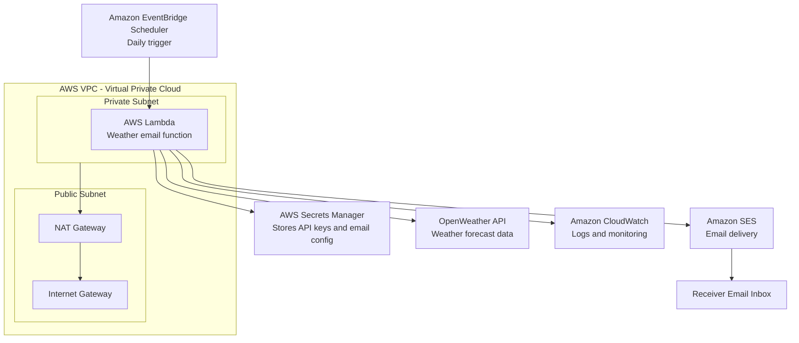

# Architecture Design

## Objective

The objective of the production architecture is to automate the daily weather forecast email service using AWS serverless services.

The automated service should:

* Run once every day
* Fetch current weather and forecast data for a configured latitude and longitude
* Format the forecast into an HTML email report
* Send the email to a configured receiver
* Store secrets securely
* Provide logs for monitoring and debugging

## Cloud Provider

This design uses AWS — Amazon Web Services.

AWS is a cloud platform that provides compute, networking, storage, security, monitoring, and automation services.

## High-Level Production Architecture

The production workflow is:

1. Amazon EventBridge Scheduler triggers the workflow daily.
2. AWS Lambda runs the Python weather email script.
3. AWS Lambda reads API keys and email configuration from AWS Secrets Manager.
4. AWS Lambda calls the OpenWeather API to fetch forecast data.
5. AWS Lambda formats the weather data into an HTML report.
6. AWS Lambda sends the report through Amazon SES.
7. Amazon CloudWatch stores logs for monitoring and debugging.

## Architecture Diagram

## Service Components

### AWS Lambda

AWS Lambda is a serverless compute service.

It runs the Python weather email script without requiring a dedicated server. In this project, Lambda is responsible for:

* Fetching weather data
* Preparing the HTML report
* Sending the email
* Writing logs to CloudWatch

### Amazon EventBridge Scheduler

Amazon EventBridge Scheduler is a serverless scheduling service.

It triggers the Lambda function automatically once per day. This removes the need to run the notebook manually.

### AWS Secrets Manager

AWS Secrets Manager is a secure secret storage service.

It stores sensitive values such as:

* OpenWeather API key
* Sender email
* Receiver email
* Latitude and longitude configuration

This avoids hardcoding secrets inside source code.

### Amazon SES — Simple Email Service

Amazon SES is AWS's email sending service.

It is used in the production design to send the daily weather forecast email. For the notebook demonstration, Brevo was used because it is simple to test from Google Colab. For production on AWS, Amazon SES is the recommended cloud-native option.

### Amazon CloudWatch

Amazon CloudWatch is AWS's logging and monitoring service.

It stores Lambda execution logs, error messages, and runtime information. This helps in debugging and monitoring the daily email workflow.

### Amazon VPC — Virtual Private Cloud

Amazon VPC is a private network inside AWS.

The assignment asks for Terraform code from VPC and subnet to function creation, so the design includes a VPC with:

* Public subnet
* Private subnet
* Internet Gateway
* NAT Gateway
* Route tables

### Subnet

A subnet is a smaller network section inside a VPC.

This design uses:

* Public subnet for internet-facing networking components
* Private subnet for the Lambda function

### Internet Gateway

An Internet Gateway allows resources in a public subnet to connect to the internet.

In this architecture, the Internet Gateway is attached to the VPC and used by the public subnet.

### NAT Gateway — Network Address Translation Gateway

A NAT Gateway allows resources inside a private subnet to access the internet without allowing inbound internet traffic directly to those private resources.

In this project, the Lambda function needs outbound internet access to call OpenWeather API. Since the Lambda function is placed in a private subnet, outbound traffic is routed through the NAT Gateway.

### IAM — Identity and Access Management

IAM is AWS's permission management service.

It controls what the Lambda function is allowed to do. The Lambda execution role should have permissions to:

* Write logs to CloudWatch
* Read secrets from Secrets Manager
* Send emails using Amazon SES
* Create network interfaces when running inside a VPC

## Design Choices

### Why Serverless?

A serverless design is suitable because the weather email job runs only once per day. Running a dedicated server continuously would be unnecessary and more expensive.

AWS Lambda runs only when triggered, which makes it cost-efficient for scheduled tasks.

### Why EventBridge Scheduler?

EventBridge Scheduler is used because the workflow needs to run automatically every day.

It removes the need for manual notebook execution or external cron jobs.

### Why Secrets Manager?

Secrets Manager is used because API keys and email configuration should not be hardcoded in code or committed to GitHub.

This improves security and makes secret rotation easier.

### Why Amazon SES?

Amazon SES is used in the production architecture because it is a cloud-native AWS email service designed for transactional and notification emails.

### Why VPC and Private Subnet?

The assignment specifically asks for Terraform code from VPC and subnet to function creation.

The Lambda function is placed in a private subnet to follow a more secure production-oriented design. It uses NAT Gateway for outbound internet access to the OpenWeather API.

## Production Workflow

The production workflow is:

1. EventBridge Scheduler triggers Lambda every morning.
2. Lambda retrieves secrets from Secrets Manager.
3. Lambda fetches weather data from OpenWeather API.
4. Lambda creates an HTML weather report.
5. Lambda sends the report through Amazon SES.
6. CloudWatch captures execution logs.
7. If there is an error, logs can be reviewed in CloudWatch.

## Notes

In the notebook implementation, Brevo Transactional Email API is used for easy demonstration from Google Colab.

In production, Amazon SES is recommended because the rest of the infrastructure is designed on AWS.

If the AWS account is in the Amazon SES sandbox, the sender and receiver email addresses may need to be verified before emails can be sent successfully.
