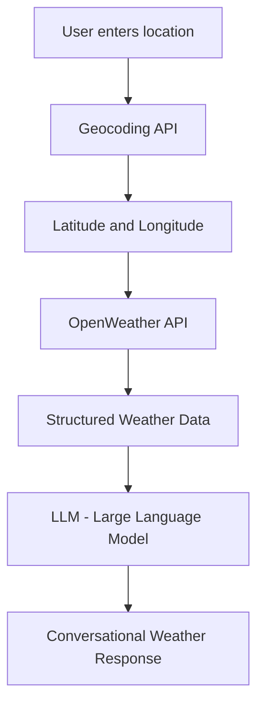
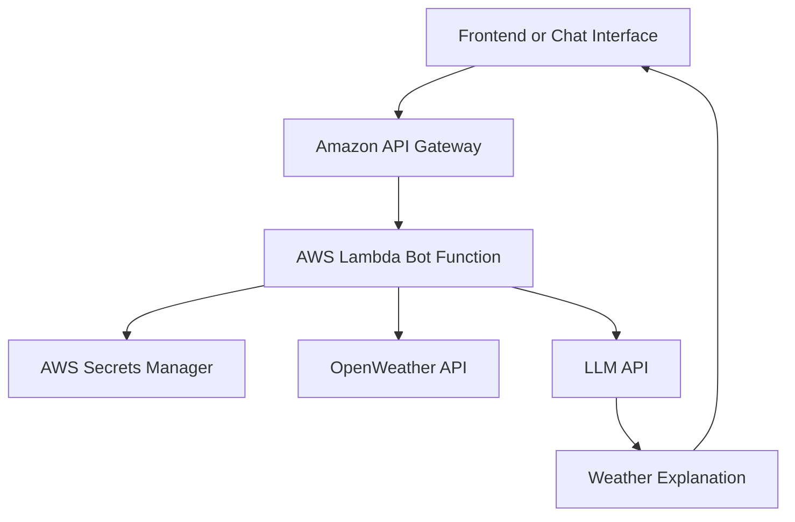

# Bonus Deliverable: LLM Weather Bot Service

## Objective

The bonus objective is to design a weather bot service that allows a user to ask for weather information using natural language.

Instead of requiring the user to manually provide latitude and longitude, the bot can accept a location such as:

* Bangalore
* Kolkata
* Mumbai
* London
* New York

The service then fetches weather forecast data and uses a Large Language Model to generate a human-friendly weather summary.

## Full Forms

### LLM — Large Language Model

A Large Language Model is an artificial intelligence model that can understand and generate human-like text.

In this project, the LLM is used to convert raw weather forecast data into a clear conversational response.

### API — Application Programming Interface

An API allows one software system to communicate with another.

This project uses APIs to get weather data and optionally call an LLM service.

### Geocoding

Geocoding is the process of converting a location name into latitude and longitude.

For example:

```text
Bangalore, India → 12.9716, 77.5946
```

### AWS — Amazon Web Services

AWS is the cloud platform recommended for production deployment.

### Lambda — AWS Lambda

AWS Lambda is a serverless compute service. It can run the bot backend without managing servers.

## Bot Workflow

The bonus weather bot can follow this workflow:

1. User enters a location.
2. The system converts the location into latitude and longitude using OpenWeather Geocoding API.
3. The system fetches current and forecast weather data using OpenWeather API.
4. The weather data is summarized into a structured prompt.
5. The prompt is passed to an LLM.
6. The LLM generates a conversational weather response.
7. The user can ask follow-up questions.

## Example User Questions

The bot should be able to answer questions such as:

```text
What is the weather in Bangalore today?
```

```text
Will it rain in Kolkata tomorrow?
```

```text
Should I carry an umbrella in Mumbai today?
```

```text
Give me a 5-day weather summary for Delhi.
```

```text
Is it a good day for outdoor work in Chennai?
```

## Example Bot Response

```text
The weather in Bangalore is currently cloudy with a temperature of around 24°C. 
Humidity is high, so it may feel slightly warmer than the actual temperature. 
There is a moderate chance of rain later in the day, so carrying an umbrella would be a good idea.
```

## Suggested Architecture

The bonus weather bot can be added as a lightweight extension to the existing project.



## Production Architecture Option

For production deployment, the bot can be hosted using AWS serverless services.



## Service Components

### Amazon API Gateway

Amazon API Gateway is an AWS service used to expose backend services as HTTP APIs.

It can receive user questions from a frontend or chat interface.

### AWS Lambda

AWS Lambda runs the bot logic.

The Lambda function can:

* Receive the user location
* Call the geocoding API
* Fetch weather forecast data
* Call the LLM API
* Return the final response

### AWS Secrets Manager

AWS Secrets Manager stores API keys securely.

It can store:

* OpenWeather API key
* LLM API key

### OpenWeather API

OpenWeather API provides current weather and forecast data.

### LLM API

The LLM API converts structured weather data into natural language.

Possible providers include:

* OpenAI
* Anthropic
* Google Gemini
* AWS Bedrock

### AWS Bedrock

AWS Bedrock is an AWS service that provides access to foundation models through managed APIs.

It can be used if the whole production solution needs to stay within AWS.

## Example Prompt Design

The following prompt can be used for the LLM:

```text
You are a helpful weather assistant.

Use the weather data below to answer the user's question clearly.

Rules:
- Do not invent weather data.
- Mention temperature, humidity, rain probability, and wind if available.
- Give practical advice if relevant.
- Keep the response concise and easy to understand.

User question:
{user_question}

Weather data:
{weather_data}
```

## Example Python Pseudocode

```python
def weather_bot(user_question, location_name):
    coordinates = get_coordinates_from_location(location_name)

    weather_data = fetch_weather_data(
        latitude=coordinates["lat"],
        longitude=coordinates["lon"]
    )

    prompt = build_llm_prompt(
        user_question=user_question,
        weather_data=weather_data
    )

    answer = call_llm(prompt)

    return answer
```

## Design Choice

The current assignment uses latitude and longitude directly because that is the mandatory requirement.

The bonus bot improves usability by allowing users to type a normal location name instead of manually entering coordinates.

## Future Improvements

Possible improvements include:

* Add voice-based weather assistant
* Add multiple location comparison
* Add severe weather alert explanation
* Add support for follow-up questions
* Add WhatsApp or Telegram integration
* Add weather recommendations for travel, energy assets, and outdoor work
* Store conversation history for better follow-up responses

## Summary

The LLM weather bot is a bonus extension of the core weather email service.

The main project fetches weather data and sends email reports.

The bonus bot makes the same weather intelligence conversational by allowing users to ask weather questions in natural language.